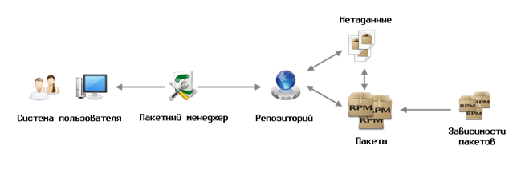
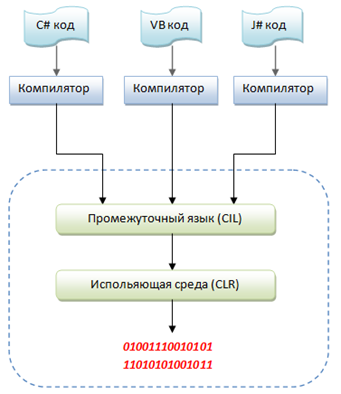
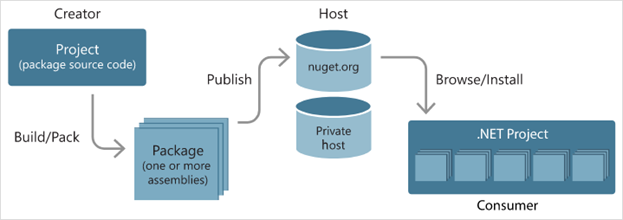

# Введение

Современное развитие информационных технологий немыслимо без использования специализированных инструментов управления программным обеспечением. Один из таких инструментов — **система управления пакетами NuGet**, которая предназначена для упрощения и автоматизации процесса установки, обновления и удаления библиотек и компонентов в проектах на платформе .NET. В рамках данного доклада мы узнаем что такое NuGet, рассмотрим его основные возможности, преимущества и недостатки, а также разберем что из себя представляет платформа .NET, для которой NuGet и предназначен.

# Что такое менеджер пакетов

**Менеджер пакетов** следит за тем, какие программы установлены на вашем компьютере, и позволяет вам легко устанавливать новые программы, обновлять программы до более новых версий или удалять те программы, которые вы ранее установили. Как предполагает само название, менеджеры пакетов имеют дело с пакетами — наборами файлов, которые упакованы вместе и могут быть установлены или удалены группой.

**Пакетный менеджер** позволяет установить дополнительные программы, библиотеки и зависимости, необходимые для работы определенной программы, а также обновлять все пакеты системы до последних версий с помощью одной команды. Он также может автоматически разрешать конфликты между пакетами и обеспечивать безопасность системы путем подписывания пакетов цифровыми сертификатами.

В целом, пакетные менеджеры значительно упрощают управление программным обеспечением и делают процесс установки, обновления и удаления программ более простым, безопасным и эффективным. 

# Что такое пакет

Пакет, по сути, представляет собой архив, содержащий в себе исполняемые файлы, библиотеки, конфигурационные файлы и другие ресурсы, необходимые для работы определенного программного продукта или библиотеки. Пакет может также содержать метаданные, описывающие его версию, авторство, зависимости и другую информацию.

Зачастую, пакет представляет собой просто отдельную программу. Например, клиент мгновенных сообщений gaim находится в пакете Debian с таким же именем. С другой стороны, для программ вполне нормально состоять из нескольких взаимосвязанных пакетов. Например, графический редактор gimp состоит не только из пакета gimp, но и из пакета gimp-data; так же доступны необязательные пакеты с дополнениями. Несколько небольших связанных программ могут входить в один пакет, например, пакет fileutils содержит несколько общих команд Unix, таких как ls, cp и т.д.

# Что такое .Net

Система управления пакетами NuGet предназначена для платформы .NET. Что же из себя представляет платформа .NET, как работает и зачем она нужна?

**.NET** — это фреймворк от Microsoft, который позволяет использовать одни и те же пространства имён, библиотеки и API для разных языков. Чаще всего это четыре языка из семейства .NET: C#, Visual Basic, Visual C++, F#.

До 2014 года .NET работал только в операционной системе Windows, однако потом был создан .NET Core. .NET Core - это кросс-платформенная среда разработки, которая позволяет создавать приложения, работающие на разных операционных системах, включая Linux. 

# Зачем нужна .NET

Если бы не .NET, пользователям пришлось бы устанавливать среду исполнения для программ на каждом языке. То есть чтобы запустить приложение на Visual Basic, нужно скачать среду выполнения для Visual Basic. Если же программа написана на C#, то придётся скачивать среду и для неё. Это очень быстро забьёт всё место на компьютере немного отличающимися копиями одних и тех же библиотек.

Разработчики, которые знают разные языки, могут писать общий программный продукт под конкретную .NET-платформу. Элементы этого продукта, написанные на разных языках, смогут коммуницировать между собой без каких-либо проблем. Это также объясняет то, почему комьюнити .NET такое большое и разнообразное.

# Как работает .NET

Вспомним, что такое процесс компиляции – это перевод вашего кода, понятного человеку, в бинарный код, понятный компьютеру.

В программировании на .NET компиляция и запуск приложений происходит следующим образом:

- Код из любого языка преобразовывается в код, написанный на общем языке (Common intermediate language или CIL). Этот язык является языком низшего уровня, похожего по синтаксису на язык ассемблер.

- После, этот код передаётся так называемой исполняющей среде (Common language runtime или CLR), которая берёт функции и методы из .NET Framework

- После этого конечный результат передаётся на процессор и выполняется программа. 

**CLR** – это некая «виртуальная машина», которая собственно и управляет нашими приложениями, написанными для .NET.

В ней есть такая занятная штука, как сборщик мусора (Garbage collector). Он подчищает всё ненужное, оставленное программой в оперативной памяти во время выполнения самой программы. То есть, если мы использовали, например, переменную всего один раз в программе, то после обращения к этой переменной, если она больше нигде не задействована – автоматический сборщик мусора её удаляет из оперативной памяти. Это абсолютно безопасно, а главное – это даёт огромный прирост в производительности масштабных и ресурсоёмких приложений. Это очень удобно, ведь в других языках, например в С++ чтобы достичь максимальной скорости работы приложения необходимо вручную удалять обьекты, а в этом случае нужно просчитать когда они не будут востребованы, чтобы их можно было безопасно удалить, чтобы не вызвать ошибку или крах программы.

Также такая схема сборки приложений очень удобна и тем, что происходит «компиляция на лету». То есть не компилируя программу, среда разработки может указать Вам на Ваши ошибки, а это заметно ускоряет процесс разработки.

# Пакетный менеджер NuGet

## Что такое NuGet и для чего он используется

**NuGet (изначальное название «NuPack»)** — это бесплатный пакетный менеджер с открытым исходным кодом, служащий для .NET и .NET Core механизмом совместного использования кода, поддерживаемым Microsoft. Он определяет, как создаются, размещаются и используются пакеты для .NET, а также предоставляет средства для каждой из этих ролей. Также NuGet представляет из себя унифицированное удобное хранилище готовых .NET-библиотек, написанных программистами со всего мира.

Пакет NuGet представляет собой отдельный ZIP-файл с расширением .nupkg, содержащий скомпилированный код и другие файлы, связанные с этим кодом. А также, описательный манифест, включающий такие сведения, как номер версии пакета. 

Разработчики, у которых есть код, к которому нужно предоставить общий доступ, создают пакеты и публикуют их на закрытых или открытых узлах. Потребители получают эти пакеты из соответствующих узлов, добавляют их в свои проекты, а затем вызывают функции пакета в коде своего проекта. При этом NuGet сам обрабатывает все промежуточные данные.

## Основные возможности NuGet

**NuGet** предоставляет разработчикам широкий выбор пакетов, доступных в галерее NuGet, которая является центральным репозиторием для хранения и распространения пакетов. В галерее NuGet можно найти пакеты для различных целей, включая библиотеки, фреймворки, инструменты и дополнительные ресурсы для .NET. **NuGet** поддерживает все спецификации связанные со структурой пакетов (включая локализацию и отладочные символы), а также диапазоны версий. Кроме того, разработчики могут создавать свои собственные пакеты и публиковать их в галерее для использования другими разработчиками.

**NuGet** широко используется в различных сферах программирования на .NET. Он облегчает управление зависимостями и упрощает процесс разработки приложений, предоставляет различные API для программной работы со своими службами. Разработчики могут использовать NuGet для добавления сторонних библиотек и компонентов в свои проекты, без необходимости вручную скачивать и устанавливать их. 

## Преимущества и недостатки использования NuGet

Одним из главных преимуществ NuGet является его простота использования. Разработчики могут легко добавлять и обновлять пакеты, а также удалять их, если они больше не нужны. NuGet также обеспечивает централизованное управление пакетами, что упрощает поддержку проектов и обеспечивает согласованность зависимостей.

Однако, у NuGet есть и недостатки. Галерея NuGet может содержать пакеты низкого качества или устаревшие версии пакетов. Разработчики должны быть внимательны при выборе пакетов и убедиться, что они соответствуют их требованиям. 

# Выводы

В этом докладе мы ознакомились с основными принципами работы NuGet, изучили его основные возможности и особенности. Мы выяснили, что NuGet предлагает широкий выбор пакетов из официального репозитория и позволяет также создавать и публиковать собственные пакеты для повторного использования кода. 

В заключение, можно с уверенностью сказать, что система управления пакетами NuGet является важным инструментом для профессиональных разработчиков .NET, обеспечивая удобное и надежное управление зависимостями и содействуя быстрому развертыванию и сопровождению .NET-приложений. Эффективное использование NuGet способствует увеличению производительности разработки, повышению качества программного обеспечения и облегчает совместную работу в команде.
