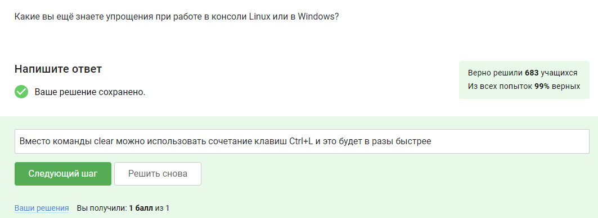
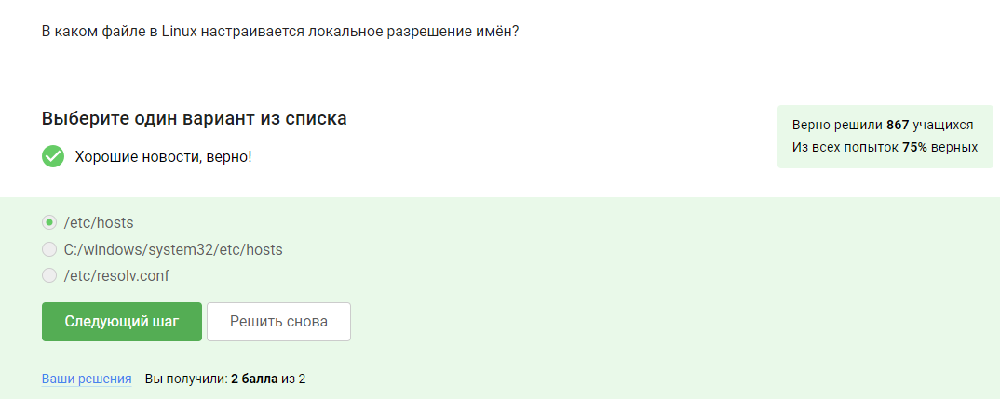
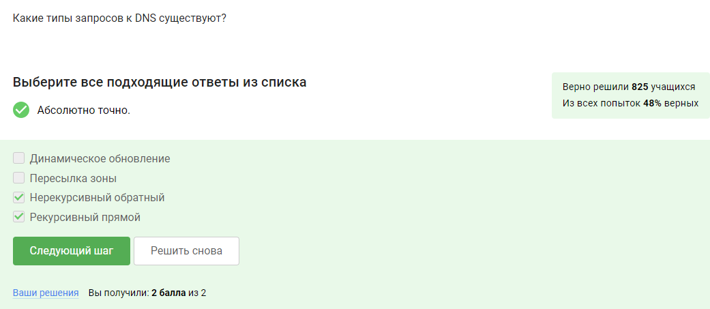
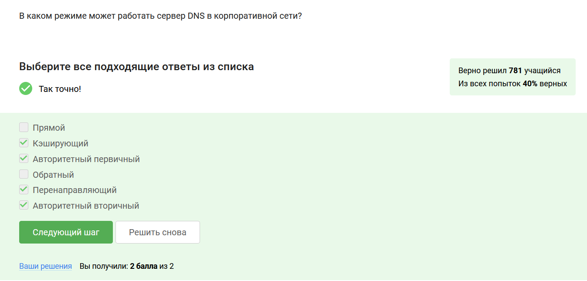
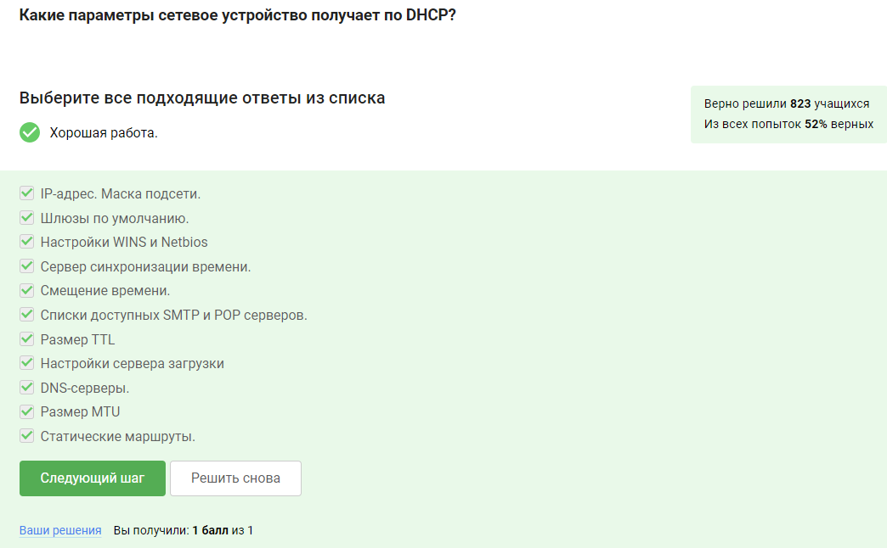

# Выполнение внешнего курса

## Раздел Введение

**Задание 1.** Какие вы ещё знаете упрощения при работе в консоли Linux или в Windows?

В курсе было приведено много возможностей упростить работу в терминале, я вспомнила и добавила то, чем пользуют сама.

## Раздел Сервисы сетевой инфраструктуры

**Задание 2.** В каком файле в Linux настраивается локальное разрешение имён?

Сразу после установки операционной системы создается файл hosts, местонахождение которого на Linux /etc/hosts.

**Задание 3.** Какие типы запросов к DNS существуют?

Существуют две подгруппы запросов: рекурсивный и нерекурсивный, прямой и обратный.

**Задание 4.** В каком режиме может работать сервер DNS в корпоративной сети?

Существует четыре режима работы: кэширующий, перенаправляющий, авторитетный (первичный — master), авторитетный (вторичный — slave).

**Задание 5.** Какие параметры сетевое устройство получает по DHCP?

Весь перечень параметров представлен в курсе, необходимо было посмотреть, какие из них приведены в задании.

**Задание 6.** Какие сетевые устройства поддерживают протокол DHCP для получения настроек сети?

DHCP (Dynamic Host Configuration Protocol) — это протокол динамической конфигурации сетевых устройств, то есть все сетевые устройства поддерживают этот протокол.

