# Выполнение внешнего курса

## Раздел Веб-службы
 

**Задание 2.** Какие вопросы возникли к теме?

В курсе всё очень доходчиво описано.

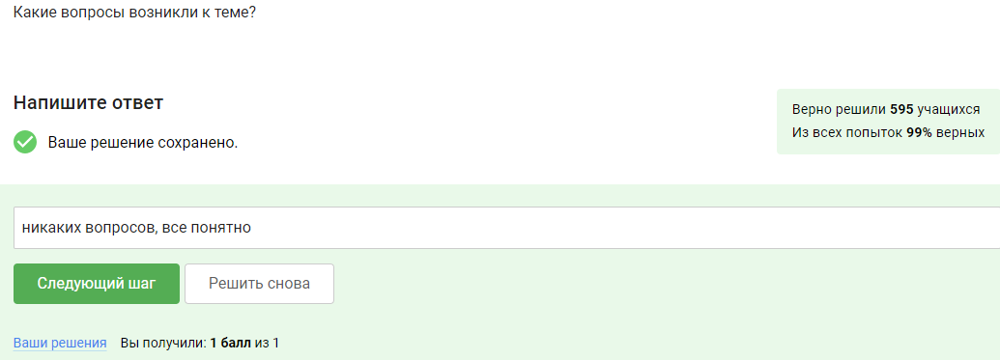

**Задание 2.** По какому протоколу взаимодействует веб-сервер с клиентом?

Основной протокол взаимподействия веб-сервера с клиентом — HTTP.

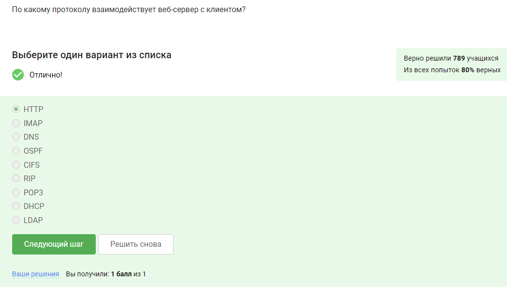

**Задание 3.** Отметьте компоненты двухуровневой и трёхуровневой клиент-серверной архитектуры веб-приложений

В двухуровневой архитектуре взаимодействуют клиент и сервер, в трехуровневой серверов два: сервер приложений и сервер базы данных.

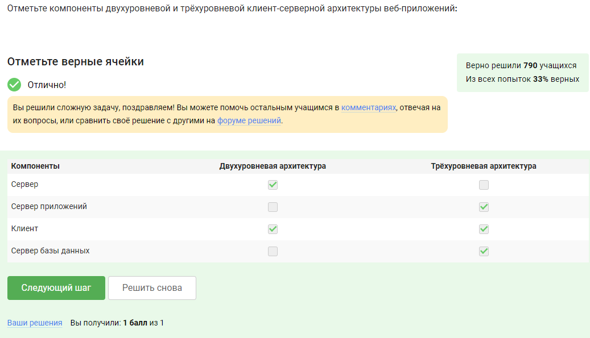

**Задание 4.** Отметьте, какой основой протокол и какие протоколы расширений используются при передаче данных Web-серверов.

Основной протокол — HTTP, остальные протоколы являются расширениями.

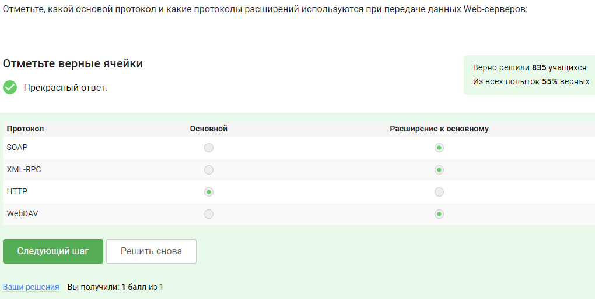

**Задание 5.** Сопоставьте правильные определения у протоколов.

Информация мной взяла из курса, там подробно описано для чего нужен каждый протокол.

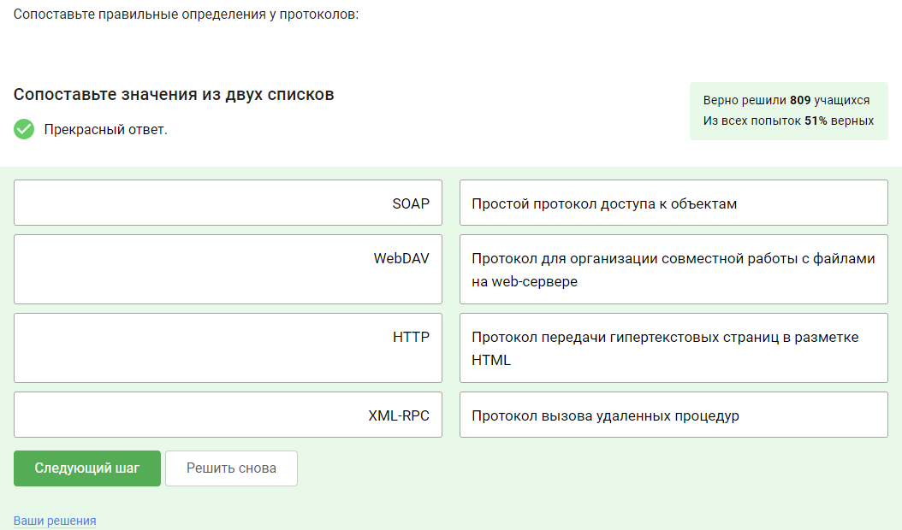

**Задание 6.** Отметьте самую распространённую версию протокола HTTP.

В курсе сказано, что протокол HTTP/1.1 является самым актуальным.

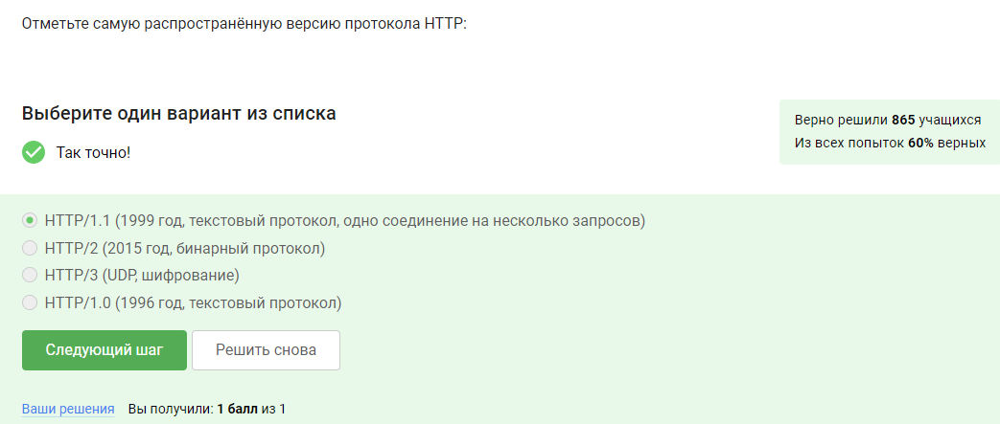

**Задание 7.** Поставьте правильные определения у методов запросов протокола HTTP/1.1.

В курсе приведены различные методы запросов с их описаниями, я брала информацию оттуда.

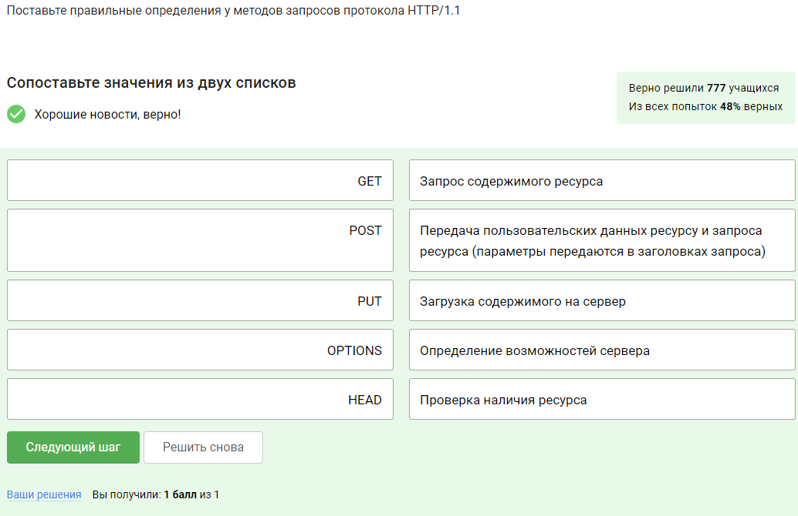

**Задание 8.** Сопоставьте коды ответов протокола HTTP/1.1 веб сервера и их определения.

Следующая после методов запросов идет информация о кодах ответов протокола, брала информацию оттуда.

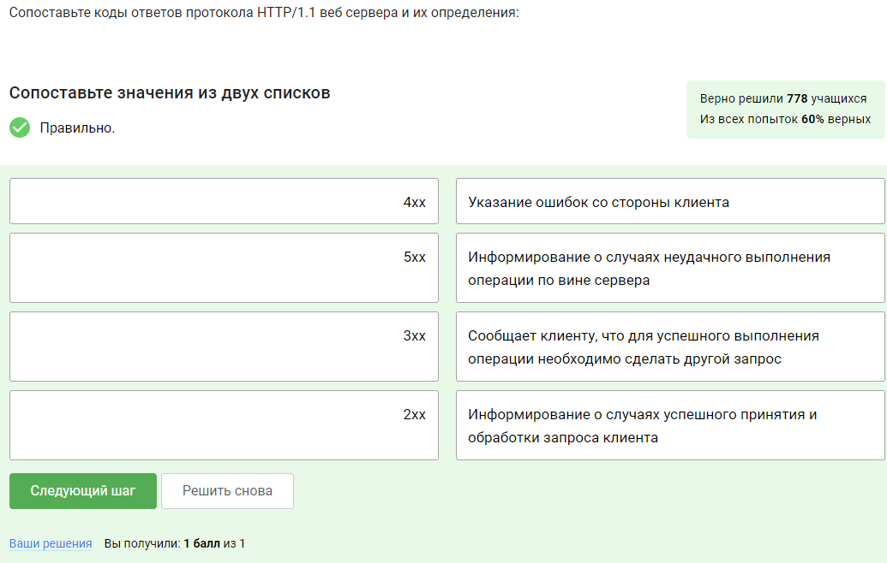

**Задание 8.** Определите, к каким описаниям протокола HTTP/1.1 относятся указанные фразы.

Это было сложное задание, в котором я опиралась на всю приведенную информацию из раздела 3.3.

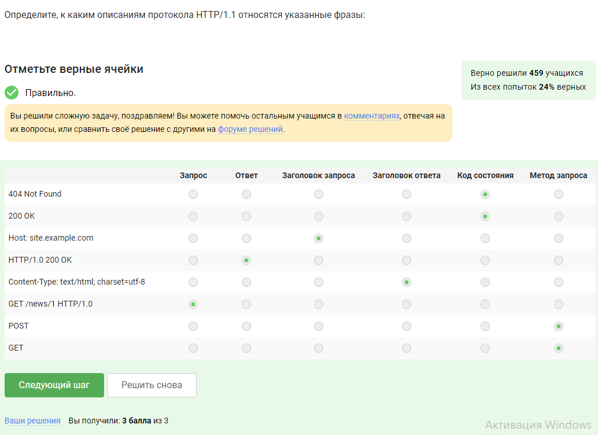

**Задание 9.** Выберите из перечисленного реализации Web-серверов.

Все три выбранных реализации Web-серверов приводятся в соответствующем теоретическом разделе.

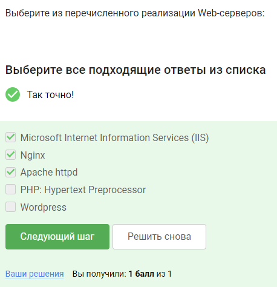

**Задание 10.** Укажите скриптовые языки и программные платформы, используемые для создания Web-серверов.

В задании представлены три из четырех предложенных в теоретическом разделе скриптовые языки и программные платформы, ещё также были указаны Python, Perl, Ruby on rails.

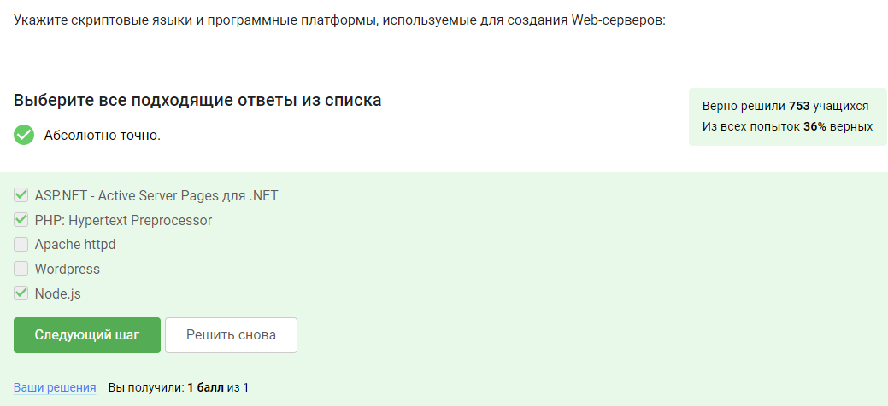

**Задание 11.** Какая система управления содержимым контентом (CMS-система) в настоящее время наиболее популярна?

Наиболее популярным и универсальным вариантом является WordPress, на котором возможно создать практически любой проект: от личного сайта до крупного портала или интернет-магазина.

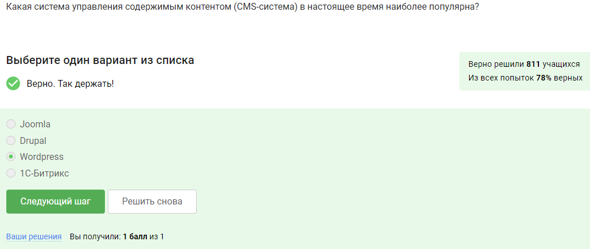

## Раздел Централизованная авторизация в сети

**Задание 12.** Какие вопросы возникли к теме?

Опять же всё интересно и доступно объяснено.

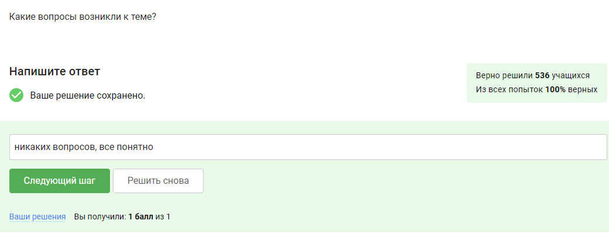

**Задание 13.** Запрос системой номера телефона, это - ...?

В курсе подробно описано отличие идентификации, аутентификации и авторизации, в данном случае проверка телефона является процедурой распознавания субъекта по его идентификатору.

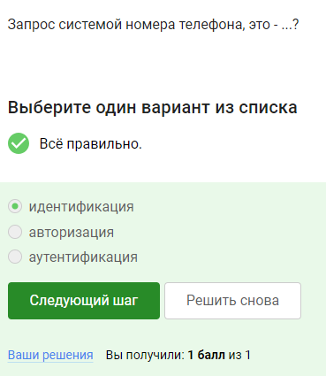

**Задание 14.** Разблокировка смартфона после сканирования отпечатка пальца, это - ...?

Разблокировка телефона - это предоставление этому лицу возможностей в соответствие с положенными ему правами.

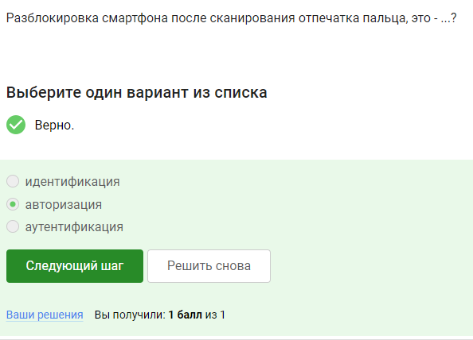

**Задание 15.** Преимущества сетевых каталогов LDAP?

Для ответа на этот вопрос нужна была следующая информация:

Сетевые каталоги:

- Хорошо масштабируются в силу своей иерархичности;
- Хорошо справляются с запросами на чтение в сравнении с запросами на запись.

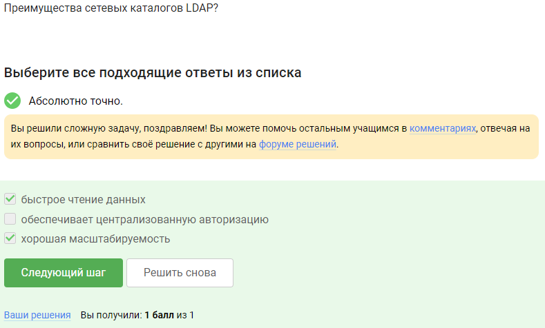

**Задание 16.** Какие типы объектов хранятся в сетевом каталоге LDAP?

В курсе приводится табличка со всеми типами объектов LDAP.

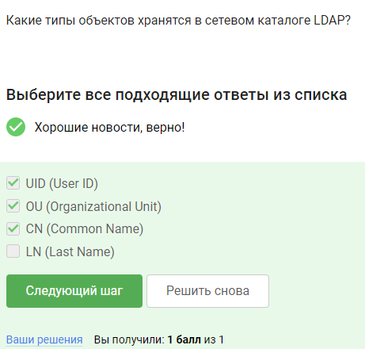

**Задание 17.** Что означает (DN, distinguished name) в каталоге LDAP?

DN - это специальный атрибут каждого объекта, он включает полный путь к записи от корня DIT и этим напоминает путь к файлу в файловой системе.

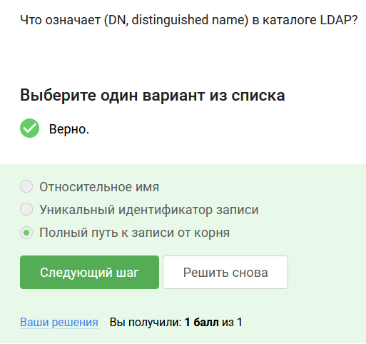

**Задание 18.** Объекты каталога Active Directory?
 
В тексте уроков упоминается, что объектом LDAP является и пользователь, и компьютер, и группы людей.

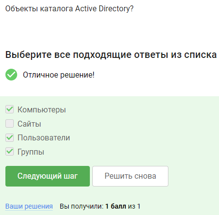

**Задание 19.** Из каких компонент состоит логическая структура Active Directory?

Из домена, дерева и леса, как сказано в уроке.

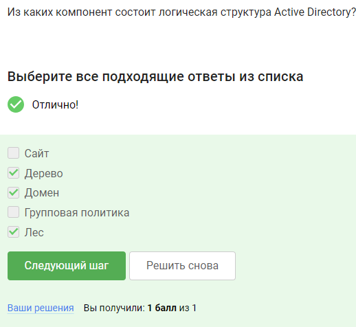

**Задание 20.** Что позволяют настраивать групповые политики Active Directory?

Настраивать можно широкий набор параметров — сценарии входа в систему и завершения сеанса работы в системе, параметры Рабочего стола и Панели управления, размещения личных папок пользователя, настройки безопасности системы (политики паролей, управления учетными записями, аудита доступа к сетевым ресурсам, управления сертификатами и т.д.), развертывания приложений и управления их жизненным циклом.

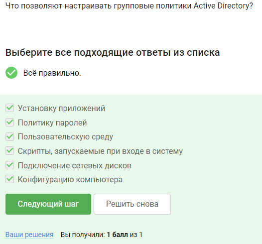

**Задание 21.** Какоe обязательное условие необходимо для успешной авторизации по протоколу Kerberos?

Работая с протоколом Kerberos, необходимо, чтобы системные часы всех участвующих во взаимодействии узлов были синхронизированы.

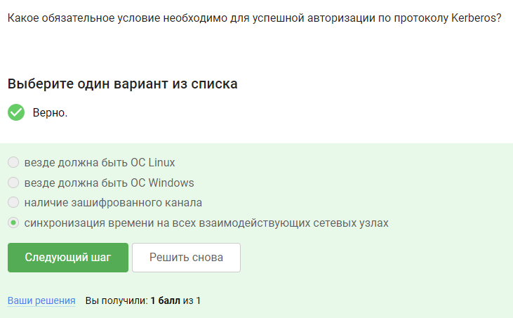

**Задание 22.** Выберите верное определение? Сквозная авторизация - это механизм, который ...

Это механизм, позволяющий пользователю пройти аутентификацию (вход со своими учетными данными) единовременно и получить доступ к различным программным продуктам, используя один идентификатор.

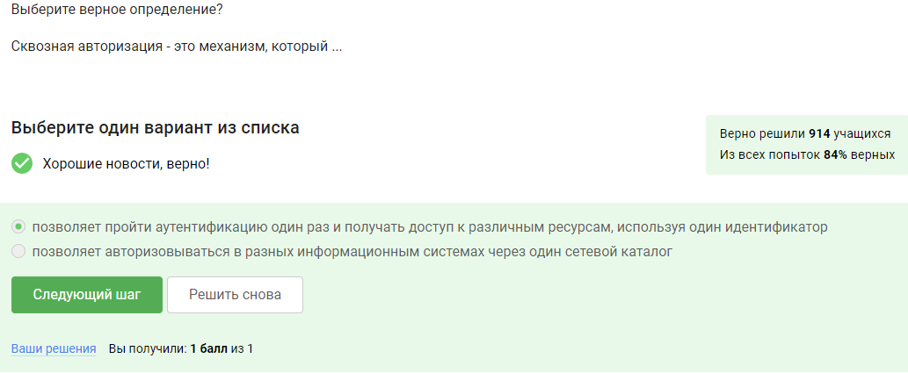

# Выводы

Я получила знания о работе веб-серверов и централизованной авторизации в сети.
