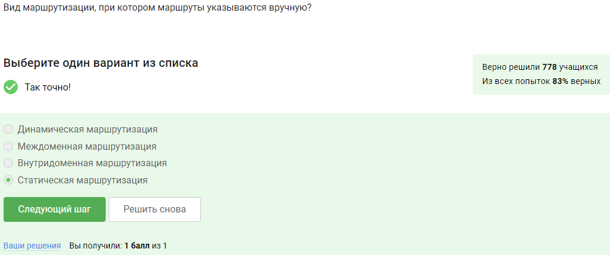
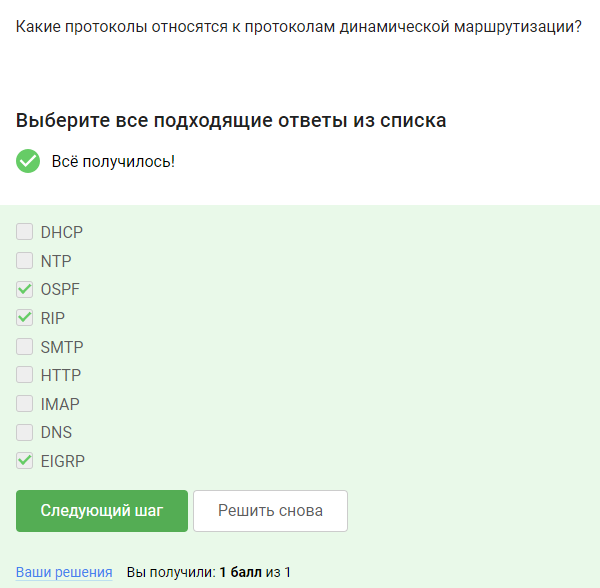
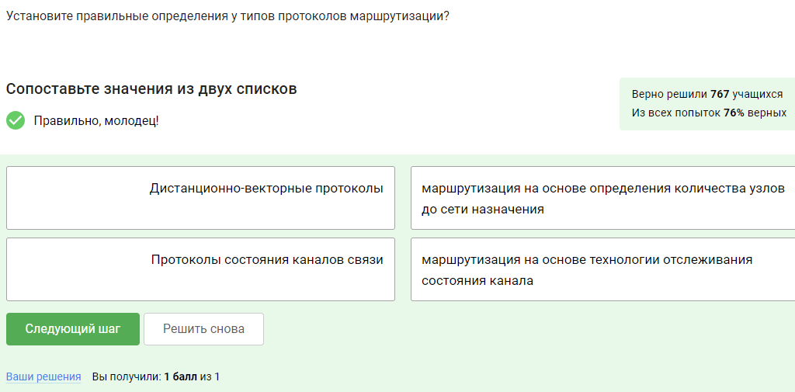
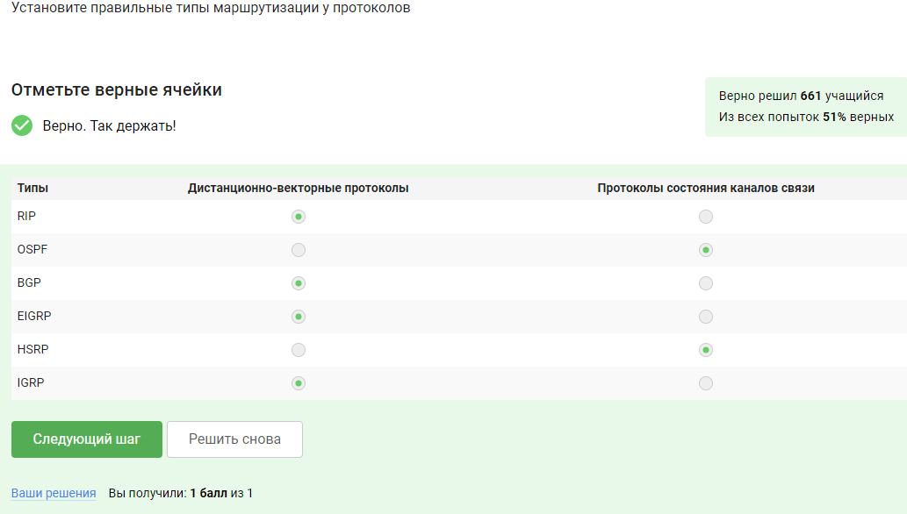
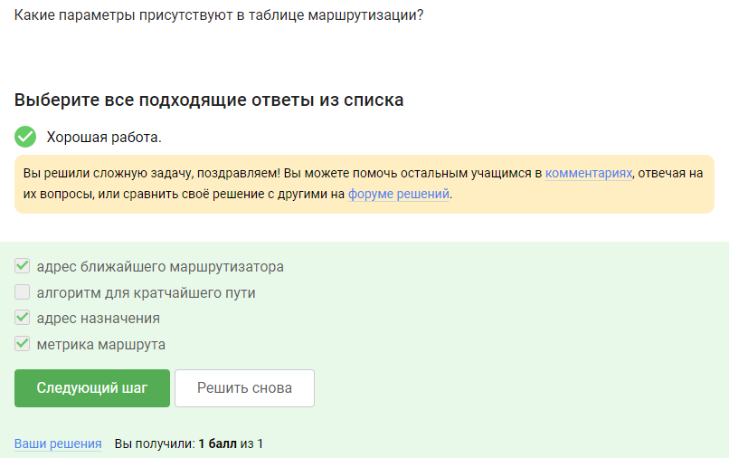
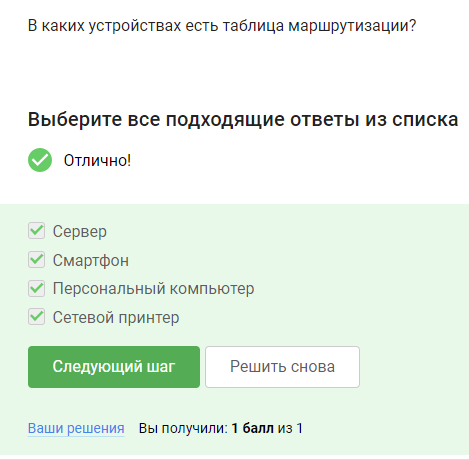
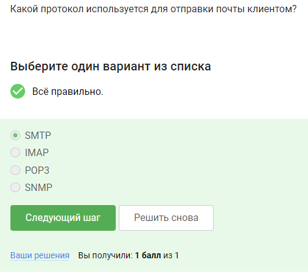
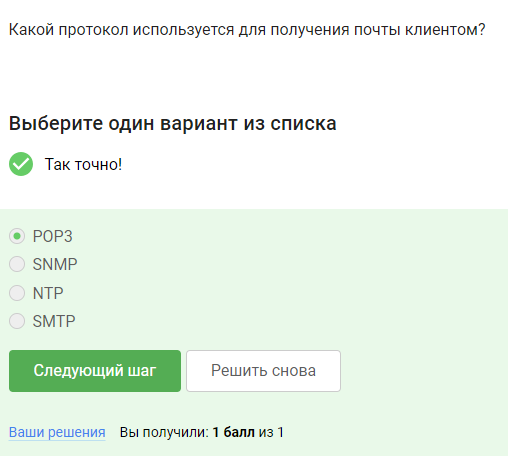
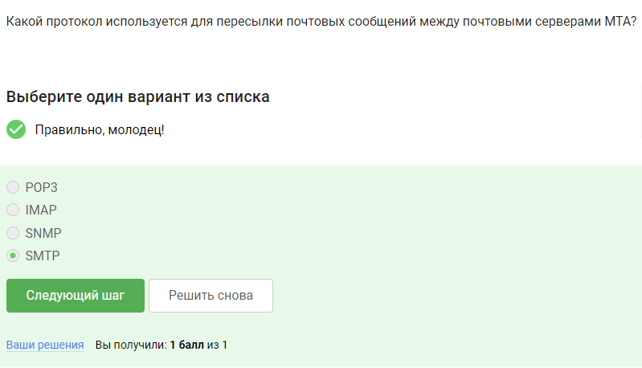
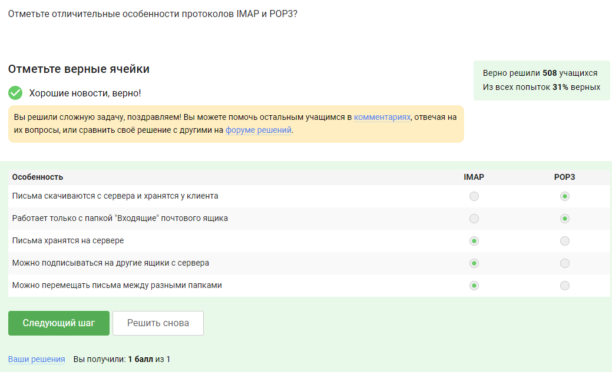

# Выполнение внешнего курса

## Раздел Маршрутизация в локальных сетях

**Задание 1.** Вид маршрутизации, при котором маршруты указываются вручную?

Статическая маршрутизация — вид маршрутизации, при котором маршруты указываются вручную при настройке маршрутизатора.

**Задание 2.** Какие протоколы относятся к протоколам динамической маршрутизации?

Протоколы RIP, BGP, EIGRP, OSPF, HSRP (список приведен в курсе).

**Задание 3.** Установите правильные определения у типов протоколов маршрутизации?

Определения даны в курсе.

**Задание 4.** Установите правильные типы маршрутизации у протоколов.

Дистанционно-векторные: RIP, BGP, EIGRP, IGRP. Протоколы состояния каналов связи: OSPF, HSRP.

**Задание 5.** Какие параметры присутствуют в таблице маршрутизации?

Параметры даны в курсе.

**Задание 6.** В каких устройствах есть таблица маршрутизации?

Во всех приведенных.

## Раздел Сервисы электронной почты

**Задание 7.** Какой протокол используется для отправки почты клиентом?

SMTP (Simple Mail Transfer Protocol ) - протокол для отправки почтового сообщения серверу MTA, а также для пересылки сообщений между почтовыми серверами (MTA).

**Задание 8.** Какой протокол используется для получения почты клиентом?

POP3 (Post Office Protocol Version 3) - протокол для получения писем от почтового сервера MDA.

**Задание 8.** Какой протокол используется для пересылки почтовых сообщений между почтовыми серверами MTA?

SMTP (Simple Mail Transfer Protocol ) - протокол для отправки почтового сообщения серверу MTA, а также для пересылки сообщений между почтовыми серверами (MTA).

**Задание 9.** Отметьте отличительные особенности протоколов IMAP и POP3?

IMAP (Internet Message Access Protocol) - протокол для получения писем от почтового сервера MDA. Может работать с разными папками на сервере, с папками внутри ящика пользователя, так и с другими папками, к которым есть доступ, при этом письма остаются на сервере.

POP3 (Post Office Protocol Version 3) - протокол для получения писем от почтового сервера MDA. Работает только с ящиком пользователя целиком, забирает письма с сервера, но есть настройка оставлять письма на сервере.

# Выводы

Я получила знания о маршрутизации в локальных сетях и работе сервисов электронной почты.
